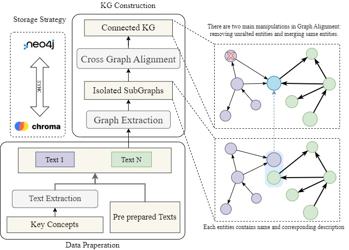
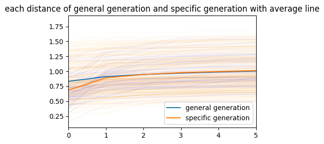

Quick Start
============

DescKGC is a Python package for automatic knowledge graph construction. It provides an end-to-end solution for knowledge graph construction, including data extraction, data cleaning, data alignment, and data storage.

The knowledge graph created by DescKGC is stored in `Neo4j <neo4j.io>`_, the graph database, and `chroma <https://www.trychroma.com/>`_, the vector database. Information between the two databases is linked by the unique identifier of the entity. With the control of the database manager, the user can easily add, delete, and modify the data in the databases. You can find the details in the implementation of :doc:`database manager </DescKGC.tools.db_manager>`.

To leverage the power of LLM, DescKGC has been integrated with `Langchain <https://www.langchain.com/>`_, a flexible abstractions and extensive toolkit enables developers to harness the power of LLMs. With the help of LLM, DescKGC can automatically extract entities and relations from the text, and then store them in the database.

Besides, DescKGC also have the ability of entity cleaning (removing unnecessary entities) and entity alignment (aligning entities from different sources with the same meaning).

The entity cleaning module uses three strategies to remove unnecessary entities: 

1. LLM-based method: With the help of LLM, each entity is assigned a label of generalization or specialization. Here, the generalization means that the entity is a general concept which is aceepted by the main stream, and the specialization means that the entity is a specific concept only in some special sources. The details can be found in the :doc:`extraction module </DescKGC.procedures.extract_and_insert>`.

2. LM-based method: Compared with the LLM, LM refers to the "small" language model, like BERT. The LM-based method uses the BERT to calculate the similarity between entities. The motivation is that the generalization entities should be able to be found in more sources in the domain, and the specialization entities should be able to be found in some specific sources. The details can be found in the :doc:`entity alignment module </DescKGC.scripts>`. In the next version, it will be isolated from the entity alignment module and become a independent module.

3. Word matching method: The word matching method uses the word match to distinguish specialization entities from generalization entities. The motivation is similar as the LM-based method, only using the word match instead of the LM. This method is still under development.

The following figure shows that above two methods lead to similar results and can be used to remove unnecessary entities.

